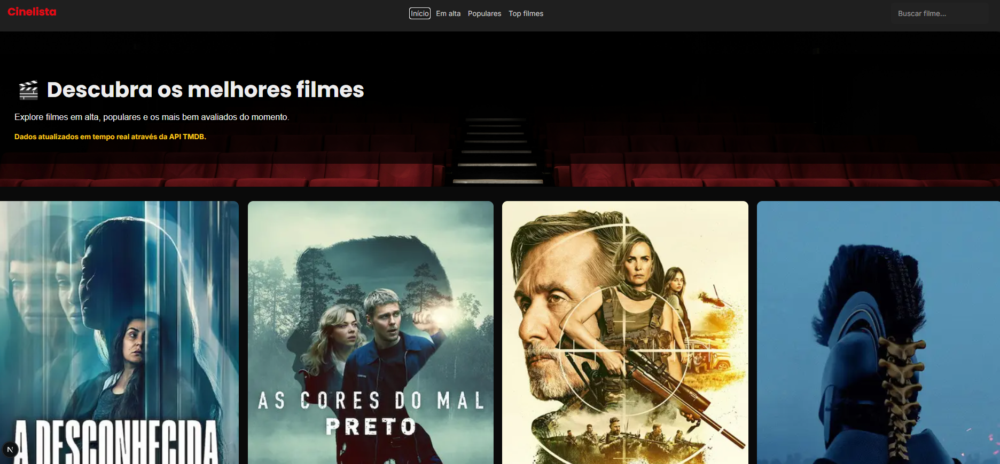
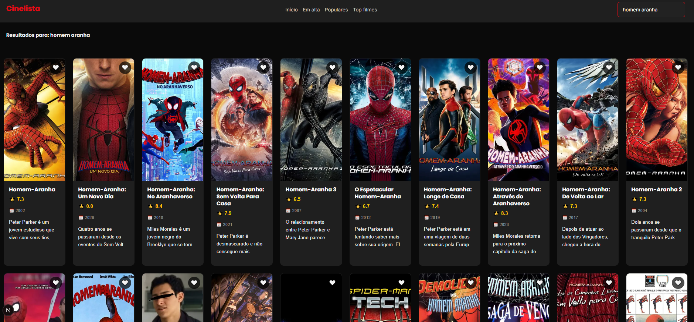
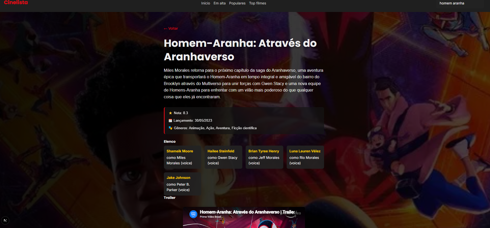

# 🎬 CineList

Aplicação web desenvolvida com **Next.js** e **TypeScript** para explorar filmes utilizando a API do **TMDB (The Movie Database)**.

O projeto permite descobrir filmes em alta, populares e mais bem avaliados, além de realizar buscas, visualizar detalhes completos e salvar filmes favoritos.

## 🚀 Funcionalidades

* 🔍 Busca de filmes em tempo real
* 🎬 Listagem de filmes em alta
* ⭐ Filmes mais populares
* 🏆 Filmes mais bem avaliados
* 📄 Página de detalhes do filme
* 🎥 Trailer integrado via YouTube
* 👥 Exibição de elenco principal
* ❤️ Sistema de favoritos
* 📱 Layout responsivo
* ⚡ Carregamento otimizado com Next.js
* 🔄 Integração contínua (CI) com GitHub Actions
* 🚀 Deploy contínuo (CD) na Vercel

## 🛠️ Tecnologias

### Front-end

* Next.js
* React
* TypeScript
* CSS Modules
* Swiper

### API

* TMDB API

### Qualidade e DevOps

* ESLint
* Jest
* GitHub Actions
* Vercel

## 🔄 Pipeline CI/CD

O projeto possui uma pipeline automatizada utilizando GitHub Actions.

### Build

* Instala dependências
* Executa lint
* Executa testes
* Gera build da aplicação

### Deploy

Após aprovação das etapas anteriores, a aplicação é publicada automaticamente na Vercel a cada push realizado na branch `main`.

## 🌐 Deploy

Aplicação online:

https://nextjs-cinelist.vercel.app

## 📸 Screenshots

### Home


### Busca


### Detalhes


### Página Inicial

* Carrossel de filmes em destaque
* Filmes em alta da semana
* Navegação rápida entre categorias

### Página de Detalhes

* Informações completas do filme
* Elenco principal
* Trailer oficial

### Favoritos

* Salve seus filmes preferidos
* Dados persistidos localmente

## 🔑 Variáveis de Ambiente

Crie um arquivo `.env.local`:

```env
TMDB_API_URL=
TMDB_API_TOKEN=
NEXT_PUBLIC_TMDB_API_IMG_URL=
```

## 💻 Executando Localmente

### Clonar repositório

```bash
git clone https://github.com/CintiaLima-83/nextjs-cinelist.git
```

### Entrar na pasta

```bash
cd nextjs-cinelist
```

### Instalar dependências

```bash
npm install
```

### Executar em desenvolvimento

```bash
npm run dev
```

A aplicação ficará disponível em:

```txt
http://localhost:3000
```

## 📚 Aprendizados

Durante o desenvolvimento deste projeto foram praticados conceitos de:

* Componentização com React
* Next.js App Router
* TypeScript
* Consumo de APIs REST
* Rotas dinâmicas
* Server Components
* Client Components
* Hooks customizados
* Testes automatizados
* CI/CD com GitHub Actions
* Deploy na Vercel

## 👩‍💻 Desenvolvedora

Cíntia Lima

* GitHub: https://github.com/CintiaLima-83

